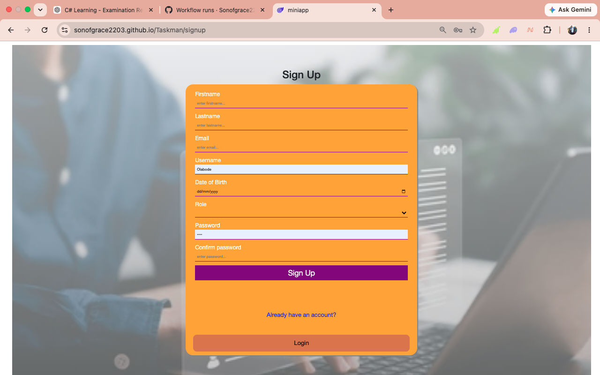

<p align="center">
  
</p>

<h1 align="center">TaskMan</h1>

<p align="center">
A modern task management application built with <strong>Blazor WebAssembly</strong>, designed to help you organize your day, stay productive, and accomplish more.
</p>

<p align="center">


</p>

---

# 📖 Project Description

TaskMan is a lightweight productivity application built with **Blazor WebAssembly**.

It helps users create, organize, search and manage daily tasks through a clean, responsive interface that works seamlessly in both the browser and as an Android application.

The project was built to strengthen my Blazor and .NET development skills while serving as a practical portfolio project.

---

# 📸 Screenshots

## Home Screen



## Dashboard


## Task Details


## Create Task


## Search & Filter


> Add more screenshots here as new features are implemented.

---

# ✨ Features

### ✅ Implemented

- Create Tasks
- Edit Tasks
- Delete Tasks
- Mark Tasks Complete
- Search Tasks
- Filter Tasks
- Task Statistics Dashboard
- Responsive Mobile UI
- Beautiful Animations
- Local Storage Persistence
- Android APK Support
- GitHub Pages Deployment

---

### 🚧 Coming Soon

- Task Categories
- Due Dates
- Priority Levels
- Dark Mode
- Notifications
- Offline Improvements
- Data Backup
- Cloud Synchronization
- Drag & Drop Tasks

---

# 🛠 Tech Stack

### Frontend

- Blazor WebAssembly (.NET 10)
- Razor Components
- HTML5
- CSS3
- Bootstrap

### Backend (Current)

- Local Storage
- C#

### Mobile

- Capacitor
- Android Studio

### Deployment

- GitHub Pages
- GitHub Actions (planned)

---

# 🚀 Installation

## Clone Repository

```bash
git clone https://github.com/Sonofgrace2203/Taskman.git
```

```bash
cd Taskman
```

Install dependencies

```bash
dotnet restore
```

Run locally

```bash
dotnet watch
```

The application will be available at

```
https://localhost:xxxx
```

---

# 📱 Android APK

Build the Android application using Capacitor.

```bash
dotnet publish -c Release

npx cap sync android

npx cap open android
```

Then generate the APK from Android Studio.

```
Build
→ Generate APK
```

---

# 🗺 Roadmap

## ✅ Phase 1 — MVP

- [x] Landing Page
- [x] Dashboard
- [x] Create Task
- [x] Edit Task
- [x] Delete Task
- [x] Task Statistics
- [x] Search Tasks
- [x] Filter Tasks
- [ ] Categories
- [ ] Branding

---

## 🚧 Phase 2

- [ ] Due Dates
- [ ] Priority Levels
- [ ] Calendar View
- [ ] Notifications
- [ ] Better Animations

---

## 🚀 Phase 3

- [ ] User Authentication
- [ ] Cloud Sync
- [ ] REST API
- [ ] PostgreSQL Backend
- [ ] Multi-device Sync

---

## 🌍 Phase 4

- [ ] iOS Build
- [ ] PWA Enhancements
- [ ] Offline Mode
- [ ] Team Collaboration

---

```
https://github.com/Sonofgrace2203/Taskman
```

---

# 🌐 Live Demo

GitHub Pages

**https://sonofgrace2203.github.io/Taskman/**

---

# 📂 Project Structure

```
Taskman
│
├── Components
├── Pages
├── Services
├── Layout
├── wwwroot
├── screenshots
├── android
└── README.md
```

---

# 🤝 Contributing

Contributions, suggestions and feedback are always welcome.

If you'd like to contribute:

1. Fork the repository
2. Create a feature branch
3. Commit your changes
4. Open a Pull Request

---

# 👨‍💻 Author

**Mustapha Olabode**

- GitHub: https://github.com/Sonofgrace2203
- LinkedIn: https://linkedin.com/in/mustaphaolabode

---

# ⭐ Support

If you found this project useful, please consider giving it a ⭐ on GitHub.

It helps others discover the project and motivates future development.

---

<p align="center">

Made with ❤️ using Blazor WebAssembly & .NET

</p>